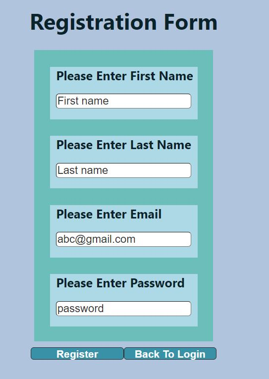
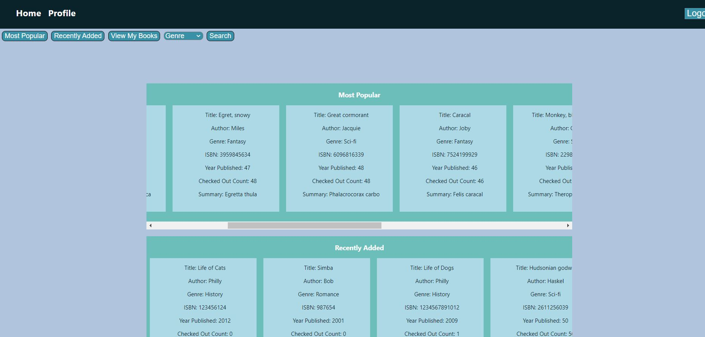
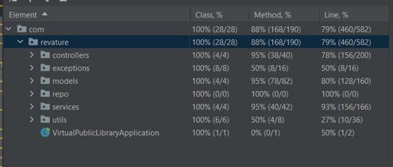

## Virtual Public Library
Virtual library system is virtual library in online. Users can search eBooks in library and checkout their favorite books. And there is a role called owner, who can manage e-book inventory.

# Technologies Used
- Java
- ReactJS
- AWS EC2
- AWS RDS
- Hibernate
- Spring Boot
- Spring Data
- PostgreSQL
- JUnit

## User stories

# As a user, you can:
- Register new account, receive welcome email

- Login/Logout
- View Homepage

- View/Edit user’s information
- Checkout Book 
- View list of previously checked out books
- Search books by title, author, genre, ISBN by using search bar 

# As an owner, you can:
- Login/Logout
- Add new books
- Delete books by ISBN
- Edit uploaded books’ info
- View all registered users’ information

# Getting Started
### Backend
- Be sure to have an AWS account with RDS enabled
- Have environment variables named DB_USERNAME, DB_PASSWORD, DB_URL, P2_EMAIL, P2_PASSWORD
- Open the VirtualPublicLibrary folder using Intellij, create file named application.properties into following path: VirtualPublicLibrary\src\main\resources
- Be sure to have Java 8 run time environment installed
### Frontend
- Open the vpl-frontend folder using Visual Studio Code
- run `npm install` in terminal to install dependencies
- run `npm start` to execute code

# Testing
- Have over 79% test coverage of service classes

# Future Features
- User would recieved a marketing email when new books are uploader
- User would recieved email with temporary password upon registration
- Add wish list for each user
- Owners can view popularity metrics

# Contributors
- Chime Palden - https://github.com/chimepalden
- Darryl Robles - https://github.com/S1m1ster 
- Joseph Link - https://github.com/jj-link
- Yue McNelis - https://github.com/yuemcn

